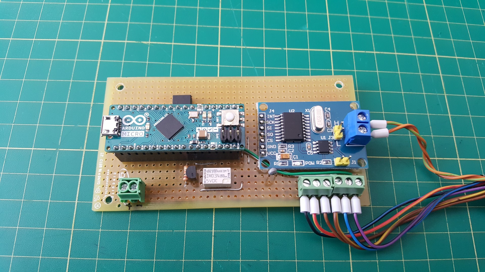

# Instrument Cluster Controller circuit

As this was a one off project, I didn't bother getting custom PCBs made, instead the interface circuit got built on some perfobard. The interface consists of:
- Arduino Micro microcontroller board
- Common MCP2515 based CAN bus interface module
- Fuel gauge control resistor chain (hidden under the Arduino)
- Relay for switching the +12V_SW switched power signal
- Thermistor for outside temperature reading

For details, see included schematic and picture below:

Screw terminal functions from left to right:
- Power supply +12V 
- Power supply GND
- Switched power signal output
- Instrument cluster +12V power supply
- Instrument cluster GND
- Thermistor output
- Fuel gauge E signal
- Fuel gauge F signal