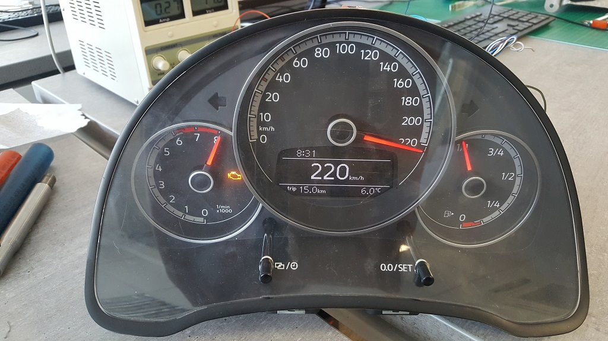
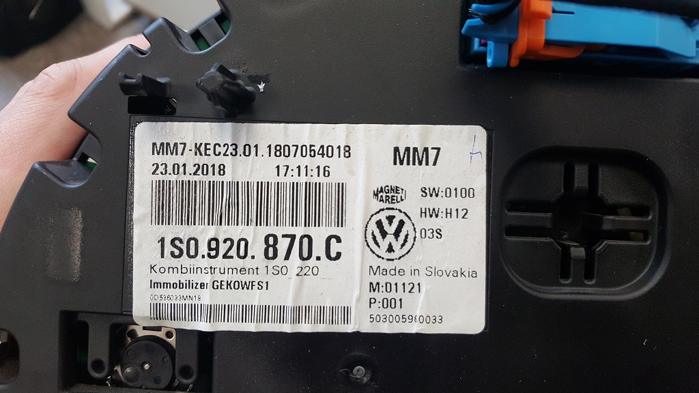
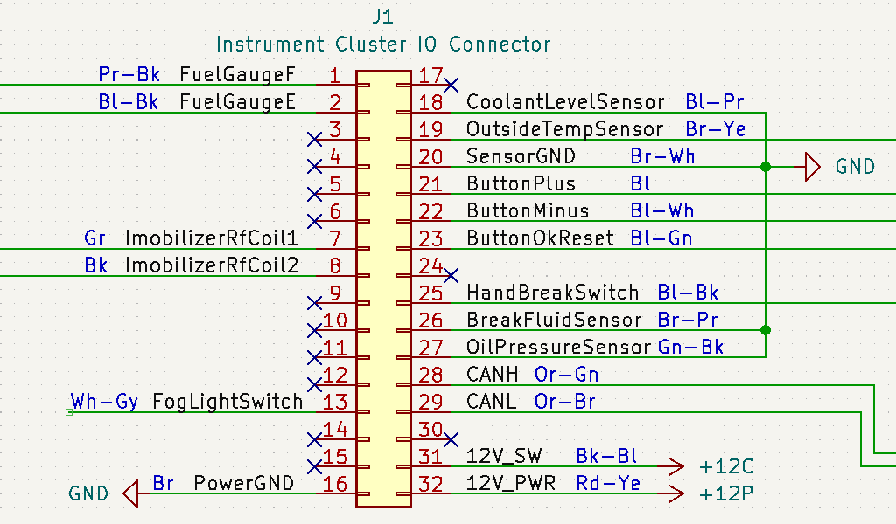
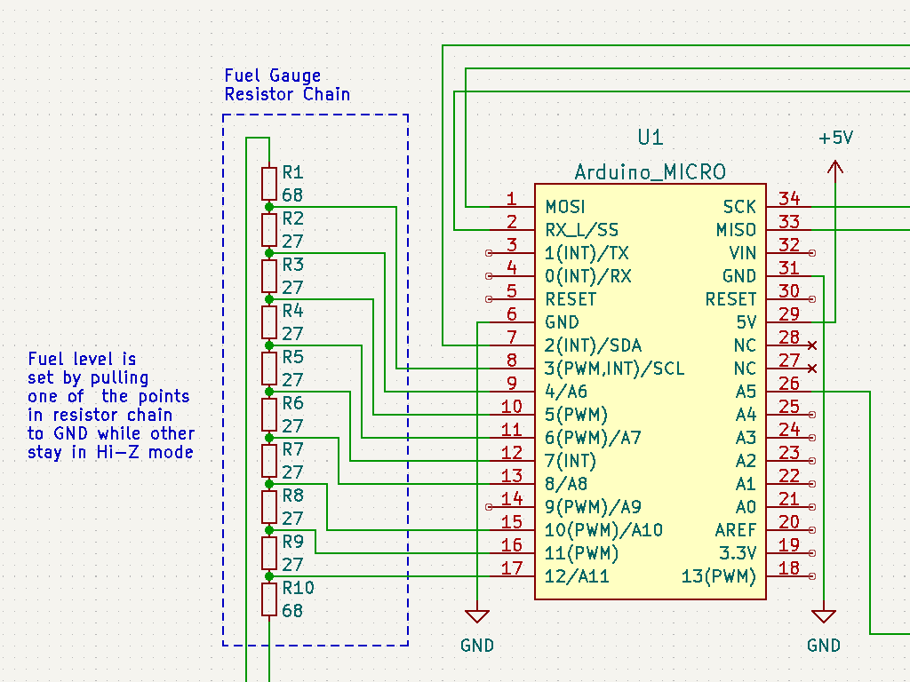

# VW Dashboard CAN controller (Based on Arduino Micro and MCP2515)

Arduino and MCP2515 based controller for a 2018 Volkswagen UP instrument cluster (part number: 1S0.920.870.C). Various instrument cluster functions are controlled by sending command strings over the USB serial port, which get then translated in to appropriate CAN messages that get periodically sent to the instrument cluster.

## Command string structure: 

    <sub_cmd1>=<parameter>;<sub_cmd2>=<parameter>;<sub_cmd3>;\n

## Command string description:
- Command string ends with "\n" (newline) character
- Command string consists of sub commands ending with ";"
- Each sub command can have a parameter separated from the sub command by "=" character
- Maximum command string length is 64 characters

## Example command string:
 
    v=100;r=2500;c=3.14;ID;\n
    
- Sub command 1: `v=100;` -> Command: `v`, Parameter: 100 (type int)
- Sub command 2: `r=2500;` -> Command: `r`, Parameter: 2500 (type int)
- Sub command 3: `c=3.14;` -> Command: `c`, Parameter: 3.14 (type float)
- Sub command 4: `ID;` -> Command: `ID`, Parameter: None

## Available commands (and parameters):

- `ID`:  Print ID string (Parameter: NONE)
- `v`:   Set vehicle speed (Parameter: vehicle speed in [km/h])
- `r`:   Set engine speed (Parameter: engine speed in [RPM])
- `c`:   Set Fuel consumption (Parameter: fuel consumption in [ml/s], type float)
- `F`:   Set Fuel level (Parameter: 0...Empty, 100...Full)
- `Tc`:  Set coolant temperature (Parameter: temperature in [°C])
- `To`:  Set oil temperature (Parameter: temperature in [°C])
- `t`:   Turn signal indicators (Parameter: 0...OFF, 1...LEFT, 2...RIGHT, 3...BOTH)
- `f`:   Fog Light indicator (Parameter: 0...OFF, 1...ON)
- `h`:   High Beam indicator (Parameter: 0...OFF, 1...ON)
- `CC`:  Cruise control indicator (Parameter: 0...OFF, 1...ON)
- `BW`:  Battery Warning indicator (Parameter: 0...OFF, 1...ON)
- `TP`:  Tire Pressure indicator (Parameter: 0...OFF, 1...ON)
- `EPC`: EPC Warning indicator (Parameter: 0...OFF, 1...ON)
- `DPF`: DPF Warning indicator (Parameter: 0...OFF, 1...ON)
- `b`:   Seat belt indicator (Parameter: 0...OFF, 1...ON)
- `D`:   Open Door indicator (Parameter: Bit0...FL, Bit1...FR, Bit2...RL, Bit3...RR, Bit4...Engine Cover, Bit5...Trunk)
- `p`:   Switched power control (Parameter: 0...OFF, 1...ON)
- `M`:   Display message on screen (Parameter: MESSAGE_ID, see Available Message IDs below)
- `BL`:  Set backlight level (Parameter: level 1=MIN...100=MAX and 0=AUTO)

### Available Display Message IDs:

-  0 ... No message
-  1 ... Start/Stop Icon
-  2 ... Start/Stop Error
-  3 ... Start Engine Manually
-  5 ... Start/Stop Disabled
- 12 ... Engine Starting
- 13 ... Depress Clutch
- 14 ... Move selector lever to position P/N
- 15 ... Apply Break

# List of used CAN messages

The following list of CAN messages has been tested on a 2018 Volkswagen UP instrument cluster (part number: 1S0.920.870.C). This list is by no means complete but should be more than enough to control basic functionality of said instrument cluster.

To avoid the "Check Engine" warning light coming on and staying on, at least the engine RPM (`0x280`) and vehicle speed (`0x5A0`) CAN messages should start sending periodically when the instrument cluster switched power +12V_SW turns on (Standby power +12V_SB should already be on or come on with switched power rail).

## Engine RPM

- Message ID: `0x280`
- Message content: `{0x49, 0x0E, LSB(AA), MAB(AA), 0x0E, 0x00, 0x1B, 0x0E}`

Engine RPM:
- 16bit value: `AA = n[RPM] * 4`

## Speedometer and distance counter

- Message ID: `0x5A0`
- Message content: `{0xFF, LSB(AA), MSB(AA), CC, 0x00, LSB(BB), MSB(BB), 0xAD}`

Speedometer:
- 16bit value: `AA = v[km/h] * 148`

Distance counter:
- 16bit counter: `BB`
- 50 counts per 1m travel distance
- Counter overflow at 30000
- Should be incremented according to current speed value in order for the speedometer to work properly

Tire pressure warning light:
- Bitfield: `CC`
- Bit 3: Tire pressure warning light

## Fuel consumption and some engine warning lights

- Message ID: `0x480`
- Message content: `{0x00, BB, MSB(AA), LSB(AA), 0x00, 0xCC, 0x00, 0x00}`

Fuel consumption:
- 16bit counter: `AA`
- 1 count per 0,25 ml of fuel consumed
- Displayed consumption value gets calculated based on the counting rate of the counter and current speedometer value
- Should be updated periodically for a stable fuel consumption reading

Warning lights:
- Bitfield: `BB`
- Bit 2: "EPC" warning light
- Bit 4: Coolant warning light
- Bitfield: `CC`
- Bit 1: Exhaust particle filter warning light

## Body lights indicators and open door status

- Message ID: `0x470`
- Message content: `{AA, BB, CC, 0x00, 0x00, FF, 0x00, HH}`

Turn signal indicators and battery warning:
- Bitfield: `AA`
- Bit 0: Left Turn signal
- Bit 1: Right Turn signal
- Bit 7: Battery warning light

Door status:
- Bitfield: `BB`
- Bit 0: Front Left
- Bit 1: Front Right
- Bit 2: Rear Left
- Bit 3: Rear Right
- Bit 4: Engine cover
- Bit 5: Trunk

Instrument cluster backlight:
- 8bit value: `CC`
- Automatic backlight control: `C = 0`
- Manual backlight control: `C = 1(min) ... 100(max)`

Key battery warning:
- Bitfield: `FF`
- Bit 7: Display "Low key battery" warning message

High beam and fog lights:
- Bitfield: `HH`
- Bit 5: High beam indicator light
- Bit 6: Fog light indicator light

## Coolant temperature reading and cruise control indicator light

- Message ID: `0x288`
- Message content: `{0x00, AA, BB, 0x00, 0x00, 0x00, 0x00, 0x00}`

Coolant temperature:
- 8bit value: `AA`
- Displayed value is not linear with input value `AA`
- Displayed value in 5°c increments
- `AA = 0x01` ... `T_coolant = -45°c` (minimum display value)
- `AA = 0x08` ... `T_coolant = -40°c`
- `AA = 0x0E` ... `T_coolant = -35°c`
- `AA = 0x15` ... `T_coolant = -30°c`
- `AA = 0x1C` ... `T_coolant = -25°c`
- `AA = 0x22` ... `T_coolant = -20°c`
- `AA = 0x29` ... `T_coolant = -15°c`
- `AA = 0x30` ... `T_coolant = -10°c`
- `AA = 0x36` ... `T_coolant = -5°c`
- `AA = 0x3D` ... `T_coolant = 0°c`
- `AA = 0x4A` ... `T_coolant = 10°c`
- `AA = 0x58` ... `T_coolant = 20°c`
- `AA = 0x66` ... `T_coolant = 30°c`
- `AA = 0x72` ... `T_coolant = 40°c`
- `AA = 0x80` ... `T_coolant = 50°c`
- `AA = 0x85` ... `T_coolant = 55°c`
- `AA = 0x89` ... `T_coolant = 60°c`
- `AA = 0x92` ... `T_coolant = 70°c`
- `AA = 0x9A` ... `T_coolant = 80°c`
- `AA = 0xA2` ... `T_coolant = 90°c`
- `AA = 0xD4` ... `T_coolant = 100°c`
- `AA = 0xD7` ... `T_coolant = 105°c`
- `AA = 0xDB` ... `T_coolant = 110°c` (coolant warning light turns off)
- `AA = 0xDE` ... `T_coolant = 115°c`
- `AA = 0xE1` ... `T_coolant = 120°c`
- `AA = 0xE6` ... `T_coolant = 125°c` (coolant warning light turns no)
- `AA = 0xE8` ... `T_coolant = 126°c`
- `AA = 0xE9` ... `T_coolant = 127°c`
- `AA = 0xEA` ... `T_coolant = 128°c`
- `AA = 0xEC` ... `T_coolant = 129°c`
- `AA = 0xED` ... `T_coolant = 130°c` (maximum display value)

Cruise control indicator:
- Bitfield: `BB`
- Bit 6: Cruise control indicator light (XOR logic with bit 7)
- Bit 7: Cruise control indicator light (XOR logic with bit 6)

## Oil temperature reading:

- Message ID: `0x588`
- Message content: `{0x00, 0x00, 0x00, 0x00, 0x00, 0x00, 0x00, AA}`

Oil temperature:
- 8Bit value: `AA = T_oil[°c] + 60`
- Minimum: `T_oil = 50°c`
- Maximum: `T_oil = 194°c`

## Airbag and seatbelt warnings

- Message ID: `0x050`
- Message content: `{0x00, AA, BB, 0x00, 0x00, 0x00, 0x00, 0x00}`

Airbag warnings:
- Bitfield: `AA`
- Bit 0: Airbag warning light
- Bit 1: Display "Airbag, Belt tensioner disabled" message
- Bit 3: Display "Airbag Error# message
- Bit 5: Seatbelt warning light

Seatbelt warnings:
- Bitfield: `BB`
- Bit 2: Seatbelt warning light

## Start/Stop system messages:

- Message ID: `0x58C`
- Message content: `{AA, 0x00, 0x00, 0x00, 0x00, 0x00, 0x00, BB}`

Start/Stop system message:
- Message ID: `AA`
- `AA = 0x01`: Display start/stop icon
- `AA = 0x02`: Display start/stop error
- `AA = 0x03`: Display "Start Engine Manually" message
- `AA = 0x05`: Display "Start/Stop Disabled" message
- `AA = 0x0C`: Display "Engine Starting" message
- `AA = 0x0D`: Display "Depress Clutch" message
- `AA = 0x0E`: Display "Move selector lever to position P/N" message
- `AA = 0x0F`: Display "Apply Brake" message

Brake pedal warning light:
- Bitfield: `BB`
- Bit 0: Green Brake Pedal Warning light

# Other functions

There are some functions, that are not controlled by sending CAN messages, instead they are controlled directly by input signals on the instrument cluster IO port. 

## Switched power

Instrument cluster has two 12V power inputs:
- Main power +12V_PWR: IO Pin 32
- Switched power +12V_SW: IO Pin 31

Switched power input is used to switch between STANDBY and ON states of the instrument cluster, while the main power input serves as power supply rail (+12V) for the instrument cluster. Most of the instrument cluster functions only work in ON mode when switched power input is high (+12V).

## Fuel level gauge

Fuel level gauge is controlled by two input signals:
- FuelGaugeF: IO Pin 1
- FuelGaugeE: IO Pin 2

A resistor chain (or a potentiometer) is connected between the two inputs. Fuel level is set by grounding the resistor chain somewhere between the two inputs (see schematic).

## Outside temperature

Outside temperature value is read from an analog input that is connected via a 3,3kOhm NTC thermistor to ground:
- OutsideTempSensor: IO Pin 19

## Various indicator lights

- Hand brake warning light: IO Pin 25, Active Low
- Fog light indicator light: IO Pin 13, Active High (+12V)

## Multi function display control inputs

There are three button inputs, that are used to select between different display functions and otherwise control the multifunction display:
- Button Plus: IO Pin 21, Active Low
- Button Minus: IO Pin 22, Active Low
- Button OK/Reset: IO Pin 23, Active Low

# Some links to useful resources

[https://hackaday.io/project/6288-can-bus-gaming-simulator](https://hackaday.io/project/6288-can-bus-gaming-simulator)

[https://vehicle-reverse-engineering.fandom.com/wiki/Volkswagen](https://vehicle-reverse-engineering.fandom.com/wiki/Volkswagen)

[https://docs.google.com/spreadsheets/d/1eirT8LbSRl4j06BpwgsiE4PM_2BGH9UStdWLXwKvHJw/edit#gid=4](https://docs.google.com/spreadsheets/d/1eirT8LbSRl4j06BpwgsiE4PM_2BGH9UStdWLXwKvHJw/edit#gid=4)

[https://wiki.openstreetmap.org/wiki/VW-CAN](https://wiki.openstreetmap.org/wiki/VW-CAN)

[https://polofreun.de/forum/index.php?thread/9562-pinbelegung-tacho-stecker/](https://polofreun.de/forum/index.php?thread/9562-pinbelegung-tacho-stecker/)

[https://www.csselectronics.com/pages/can-dbc-file-database-intro](https://www.csselectronics.com/pages/can-dbc-file-database-intro)

[https://github.com/commaai/opendbc](https://github.com/commaai/opendbc)
